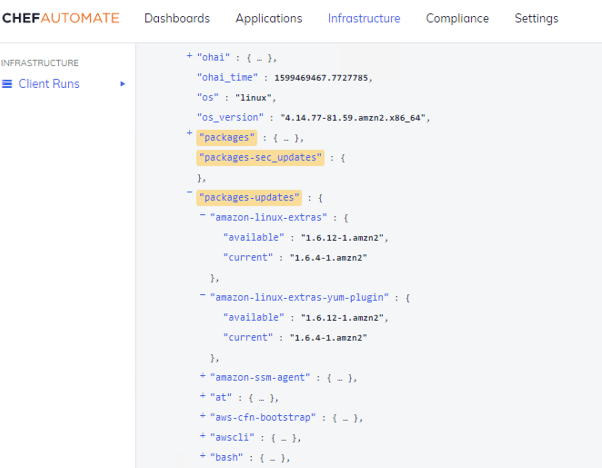

# get-pkgs

Based on the code for linux-patch-baseline security profile, this cookbook queries a list of available updates and security relevant packages for the current system and puts those information as node - `packages-sec_updates` and `packages-updates` - attributes.

### Supported Operating Systems

- RHEL 7/8
- CentOS 7
- Ubuntu 16.04+
- Windows 2016

